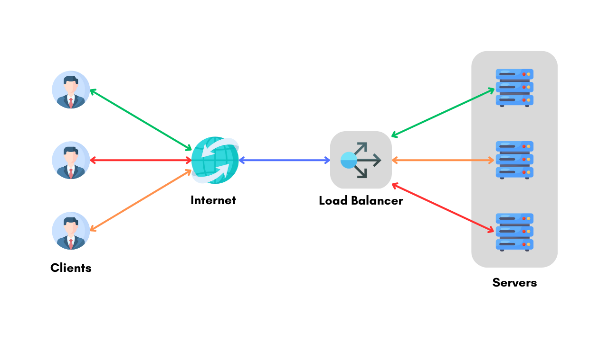

# Postmortem: Web Stack Outage on University Project

## Issue Summary
- **Duration:** August 15, 2024, 2:00 PM - 5:30 PM (PST)
- **Impact:** Our university’s online project management tool experienced a complete outage. Students and faculty were unable to access the platform, affecting approximately 60% of active users. Users experienced errors when trying to log in or access project details.
- **Root Cause:** The outage was caused by a misconfigured load balancer which led to a severe overload on a single web server, causing it to crash and resulting in a cascading failure of the remaining servers.

## Timeline
- **2:00 PM:** Issue detected when users started reporting access problems via the support chat.
- **2:05 PM:** Monitoring tools flagged high server response times and errors but did not initially indicate a critical issue.
- **2:15 PM:** Support team began investigating and found that the load balancer was not distributing traffic evenly. Initial assumption was a database issue.
- **2:30 PM:** Investigation revealed that the web server handling the majority of the traffic was overloaded. Misleading paths included checking database connections and application code.
- **3:00 PM:** Incident escalated to the DevOps team to reconfigure the load balancer settings.
- **4:00 PM:** DevOps team rebalanced the server load and restarted the affected web server.
- **5:00 PM:** Service was restored, and user access was fully restored after verifying system stability.
- **5:30 PM:** Issue fully resolved and normal operations resumed.

## Root Cause and Resolution
- **Root Cause:** The primary issue was a misconfiguration of the load balancer. It was set to route more traffic to a single web server than intended, which caused this server to become overloaded and crash. This led to a domino effect where the remaining servers were also overwhelmed, leading to a full outage.
- **Resolution:** The DevOps team reconfigured the load balancer to distribute traffic evenly across all servers. Additionally, the problematic web server was restarted, and capacity monitoring was increased to prevent similar issues.

## Corrective and Preventative Measures
- **Improvements Needed:**
  - Review and refine load balancer configurations to ensure even traffic distribution.
  - Enhance monitoring tools to detect and alert on imbalances in server load more promptly.
  - Implement automated failover and redundancy strategies to handle server overloads more effectively.

- **Tasks to Address the Issue:**
  - **Reconfigure Load Balancer:** Adjust settings to ensure even distribution of traffic among all web servers.
  - **Upgrade Monitoring Tools:** Add specific alerts for load distribution issues and server performance.
  - **Conduct Load Testing:** Perform regular load testing to identify and address potential bottlenecks before they impact users.
  - **Document Procedures:** Create detailed documentation for handling similar incidents in the future to reduce response time.

## Diagram

